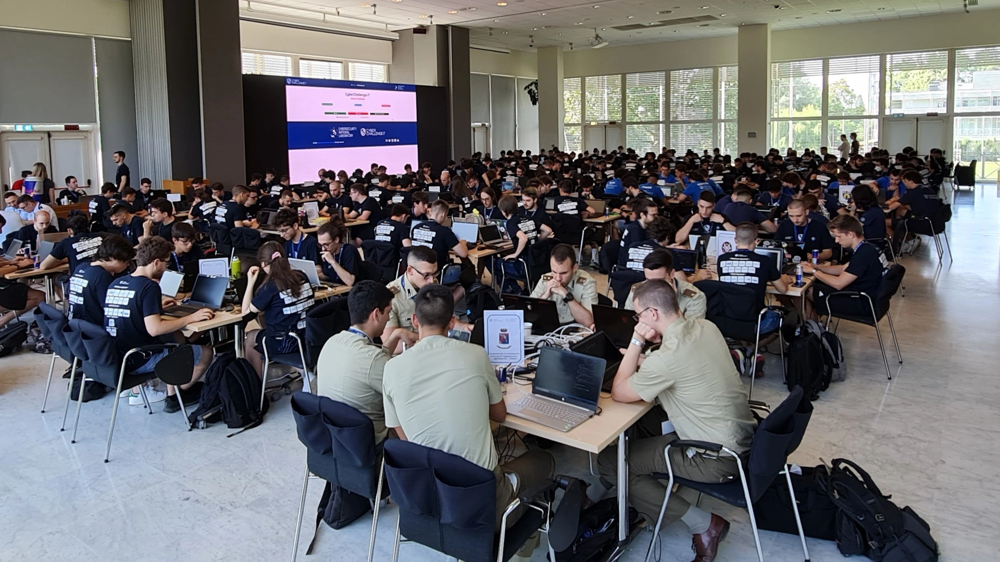
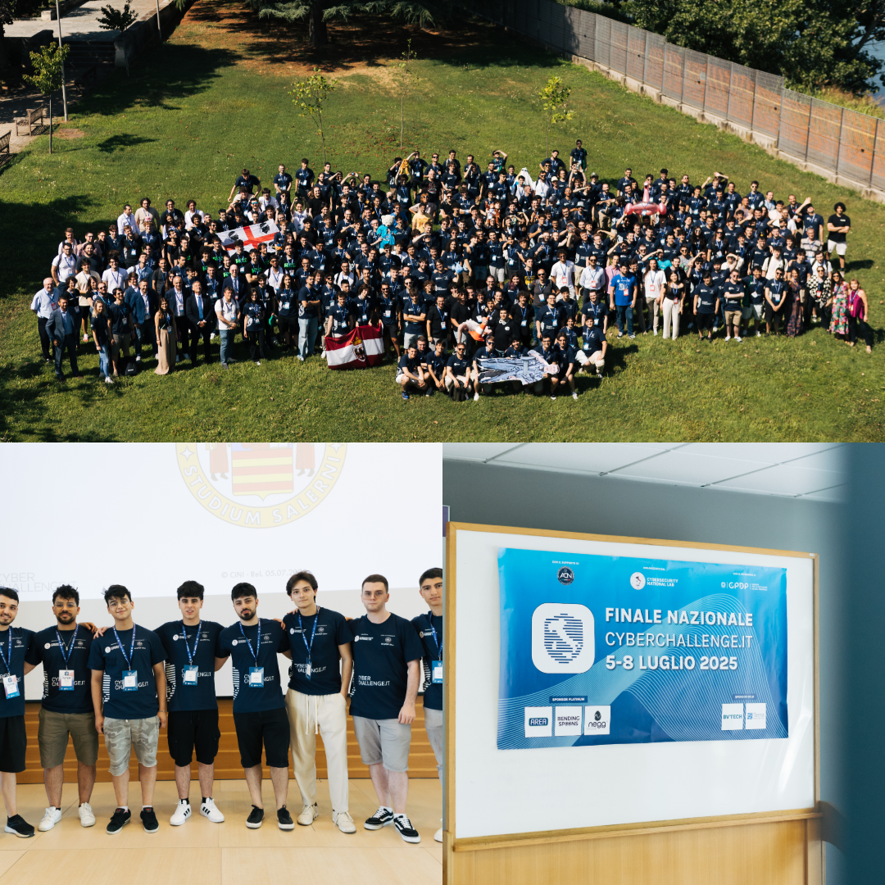

## Panoramica
CyberChallenge.IT è un programma nazionale italiano dedicato alla formazione dei giovani talenti (studenti di scuole superiori e università dai 16 ai 24 anni) della cybersecurity, un percorso intensivo che combina teoria, pratica e competizioni in stile CTF. Durante i mesi di training, i partecipanti sviluppano competenze tecniche avanzate in ambiti come ethical hacking, reverse engineering, cryptography e network security, lavorando su scenari realistici che simulano attacchi e difese informatiche. L’esperienza è fortemente collaborativa: si impara a ragionare sotto pressione, a lavorare in team e a sviluppare un metodo di problem solving rigoroso ma creativo. Oltre alle competenze tecniche, CyberChallenge.IT fa maturare una mentalità da security analyst: attenzione al dettaglio, capacità di analisi, gestione del rischio e comunicazione efficace. Per molti studenti rappresenta un punto di ingresso ingresso nel mondo della sicurezza informatica, con opportunità di networking e accesso a community altamente specializzate.

## La struttura del percorso

Il percorso si articola in diverse fasi, distribuite nell'arco di 7 mesi circa (da gennaio a giugno/luglio):

- <h3>Test di ammissione</h3> L'ingresso alla competizione avviene con un test (presso l'università scelta per la partecipazione) a risposta multipla su logica, matematica e programmazione di base e un test di programmazione dedicata.
- <h3>Training</h3> Durante il training nelle rispettive sedi, i partecipanti imparano le basi della cybersecurity, sviluppando competenze tecniche avanzate in ambiti come ethical hacking, reverse engineering, cryptography e network security, anche attraverso attività pratiche come CTF.
- <h3>Qualificazione interna</h3> Al termina del training, vi è una CTF jeopardy individuale: i partecipanti risolvono individualmente challenge di categorie diverse ( ognuna incentrata su vulnerabilità di tipo specifico) accumulando punti. La classifica finale determina i migliori studenti, che vengono selezionati per formare la squadra ufficiale della sede.
- <h3>Gara nazionale</h3> Le squadre delle varie sedi si sfidano in un CTF attack/defense: ogni team gestisce servizi vulnerabili da proteggere mentre attacca quelli avversari. Il punteggio combina difesa, attacchi riusciti e disponibilità continua dei servizi, richiedendo coordinazione, rapidità e strategia di gruppo.

## La mia esperienza personale
Ho avuto l'opportunità di partecipare, presso l'Università degli studi di Salerno, all'edizione 2024-2025 di CyberChallenge.IT, una competizione che mi ha permesso di approfondire le mie competenze tecniche e di acquisire nuove abilità in ambiti come ethical hacking, web application security, reverse engineering e cryptography. I risultati sono stati molto positivi, con la partecipazione alla finale nazionale che ha rappresentato un importante traguardo personale e formativo.
Oltre alle competenze tecniche, questa è stata soprattutto una bellissima esperienza dal punto di vista umano: ho avuto l’opportunità di stringere amicizia con i ragazzi del mio stesso team di Unisa e conoscere ragazzi provenienti da tutta Italia accomunati dalla stessa passione per l’informatica e la cybersicurezza, stringendo nuove amicizie e migliorando anche le mie competenze sociali, collaborative e comunicative.

