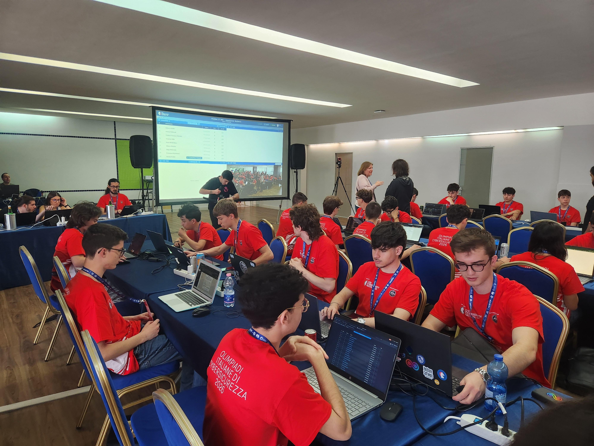

## Panoramica
OliCyber.IT, anche conosciuto come Olimpiadi Italiane di Cybersicurezza, è una competizione individuale rivolta agli studenti delle scuole superiori che mira a formare giovani talenti nei principali ambiti della cybersicurezza, tra cui sicurezza web, crittografia, reverse engineering e sicurezza software. Infatti, attraverso un percorso che combina pratica, studio autonomo e competizioni CTF, i partecipanti sviluppano competenze tecniche avanzate in ambiti come ethical hacking, reverse engineering, cryptography e network security, lavorando su scenari realistici che simulano attacchi e difese informatiche. L’esperienza porta a imparare a ragionare sotto pressione e a sviluppare un metodo di problem solving rigoroso ma creativo. Olicyber.IT fa inoltre maturare una mentalità da security analyst: attenzione al dettaglio, capacità di analisi, gestione del rischio e comunicazione efficace. Per molti studenti delle scuole superiori rappresenta il punto di ingresso ingresso nel mondo della sicurezza informatica, con opportunità di networking e accesso a community altamente specializzate.

## La struttura del percorso

Il percorso si articola in diverse fasi:

- <h3>Selezione scolastica</h3> L'ingresso alla competizione avviene con un test a risposta multipla incentrato su logica, matematica e programmazione di base.
- <h3>Selezione territoriale</h3> Una gara in stile CTF (Capture The Flag) in cui vengono proposti ambienti realistici nei quali individuare e sfruttare vulnerabilità informatiche; accedono a questa fase gli studenti che ottengono un punteggio superiore alla media nazionale nella selezione scolastica.
- <h3>Finale nazionale</h3> Una competizione finale sempre in stile CTF, a cui partecipano i migliori classificati delle selezioni territoriali fino a un massimo di 100 finalisti provenienti da tutta Italia.

## La mia esperienza personale
Ho avuto l’opportunità di partecipare alla competizione per 2 anni di seguito, raggiungendo la selezione territoriale nell’edizione 2024-2025 e sfiorando la finale nazionale, poi raggiunta nell’edizione successiva, quella del 2025-2026, ottenendo il 30° posto in Italia e conquistando la medaglia di bronzo, un risultato di cui sono molto soddisfatto e che rappresenta per me un importante traguardo personale e formativo.
Oltre alle competenze tecniche, questa è stata soprattutto una bellissima esperienza dal punto di vista umano: ho avuto l’opportunità di conoscere ragazzi provenienti da tutta Italia accomunati dalla stessa passione per l’informatica e la cybersicurezza, stringendo nuove amicizie e migliorando anche le mie competenze sociali, collaborative e comunicative.

