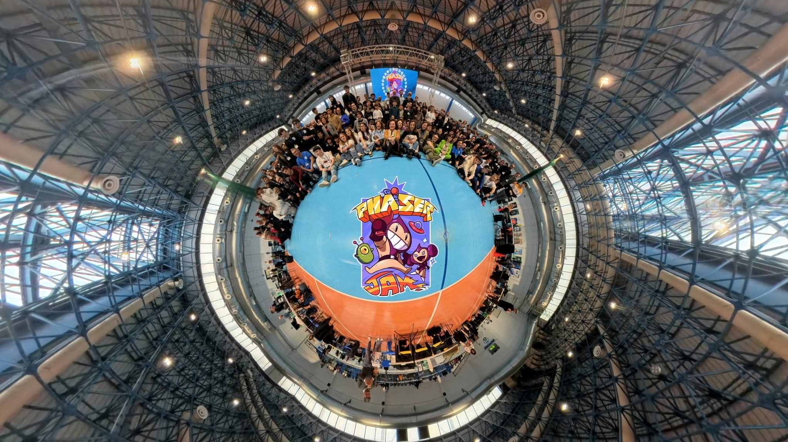
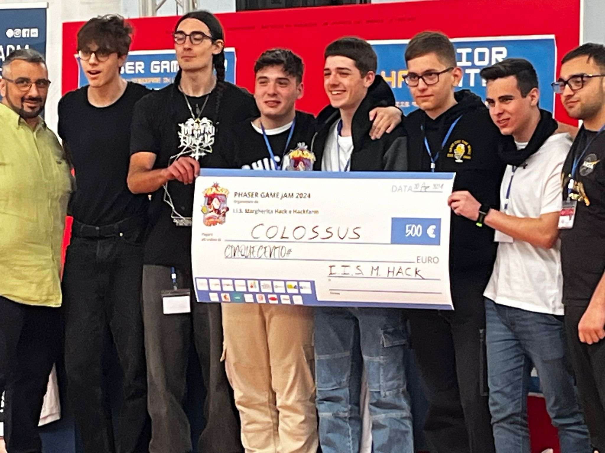
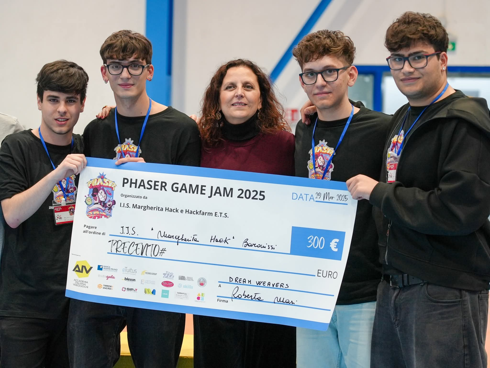
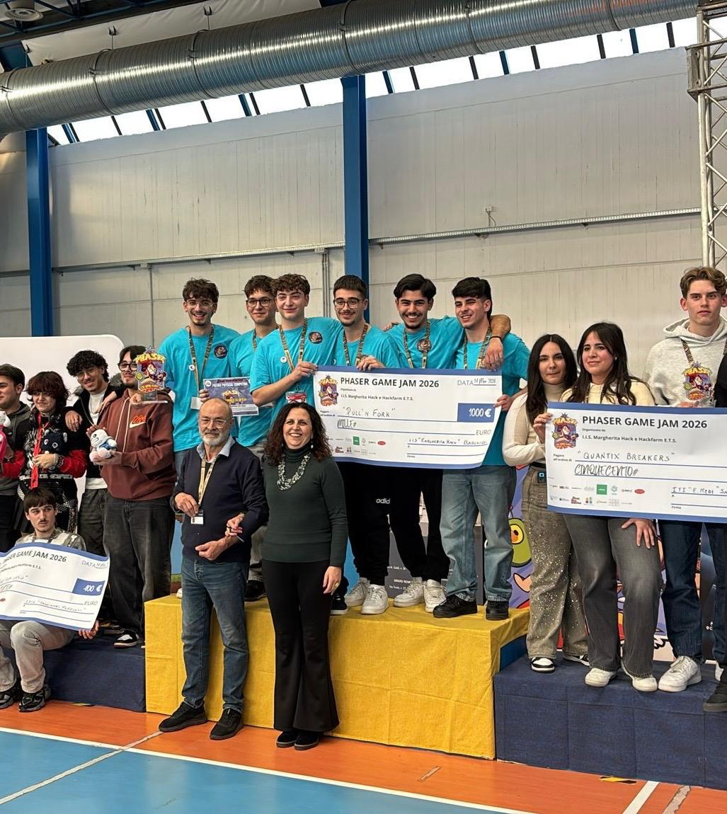

## Panoramica
Phaser Game Jam è un percorso formativo a cui prendono parte scuole da tutta la Campania (e quest'anno, per la prima volta, dalla Sardegna) che comprende un corso di formazione di 30 ore sullo sviluppo di videogiochi utilizzando il linguaggio TypeScript e la libreria Phaser e una gara di 2 giorni consecutivi in cui i team rappresentati delle scuole realizzano e presentano i propri videogiochi partendo da un tema sorteggiato all'inizio della competizione.
Durante la fase di addestramento, i partecipanti imparano i concetti fondamentali del linguaggio Typescript e successivamente integrano la libreria Phaser per realizzare videogiochi completi a tutti gli effetti, pronti per essere pubblicati.
L'esperienza è estremamente coinvolgente e permette di sviluppare non solo competenze tecniche, ma anche una mentalità volta al problem solving e al lavoro in team.

## La mia esperienza personale
Per tre anni consecutivi ho partecipato alla Phaser Game Jam, un percorso che mi ha permesso di crescere molto sia come sviluppatore sia come membro di un team. Ogni edizione mi ha dato nuove competenze, più sicurezza e una visione sempre più chiara di come trasformare un’idea in un videogioco funzionante con TypeScript e Phaser.

### 2023-2024 - Enigma
Il primo anno è stato quello dell’esordio. Stavo muovendo i miei primi passi nello sviluppo con TypeScript e Phaser, e il tema Enigma ci ha portati a creare Ruins of Deception, un gioco isometrico in cui il protagonista si risveglia in un labirinto misterioso.
Il giocatore deve esplorare stanze, risolvere enigmi e scoprire cosa si nasconde dietro quel luogo.

In questa edizione il mio ruolo era piuttosto limitato, perché lavoravo con ragazzi più esperti. Nonostante ciò, è stata un’esperienza molto utile per capire come funziona una jam e come si collabora in un team.
Il gioco è arrivato secondo, un risultato che mi ha motivato a migliorare.

### 2024-2025 - Caos
Il secondo anno ho assunto un ruolo molto più importante: ero il programmatore principale del team. Il tema Caos ci ha ispirati a creare Caos Arcade, ambientato in una dimensione parallela dominata dalla divinità del caos, Nixaroth.
In questo mondo, i giochi arcade più famosi vengono mescolati e stravolti, creando livelli imprevedibili e meccaniche sempre diverse.

Questa edizione è stata fondamentale per la mia crescita: ho gestito la struttura del codice, coordinato il lavoro e trasformato un’idea complessa in un gioco completo.
Ci siamo classificati quarti: un po’ di delusione per il risultato, ma l’esperienza è stata ottima.

### 2025-2026 - (R)Evolution
Il terzo anno è stato quello della maturità: ero sia programmatore sia leader del team. Il tema (R)Evolution ci ha portati a creare The Essence, un gioco ispirato al Game of Life di John Conway.
Abbiamo trasformato l’idea dell’evoluzione cellulare in un gioco a turni con carte speciali che possono cambiare completamente la partita.
Il tutto ambientato in due mondi diversi — natura e spazio — ognuno con regole e carte proprie.

Questa volta abbiamo vinto la competizione, chiudendo in modo perfetto un percorso iniziato tre anni prima. È stata un’esperienza davvero speciale, che mi ha permesso di mettere insieme tutto ciò che avevo imparato.

Oltre alle competenze tecniche, questa è stata soprattutto una bellissima esperienza dal punto di vista umano: ho avuto l’opportunità di stringere e rafforzare amicizia con i ragazzi e conoscere ragazzi provenienti da tante altre scuole accomunati dalla stessa passione per lo sviluppo di videogiochi, migliorando anche le mie competenze sociali, collaborative e comunicative.

