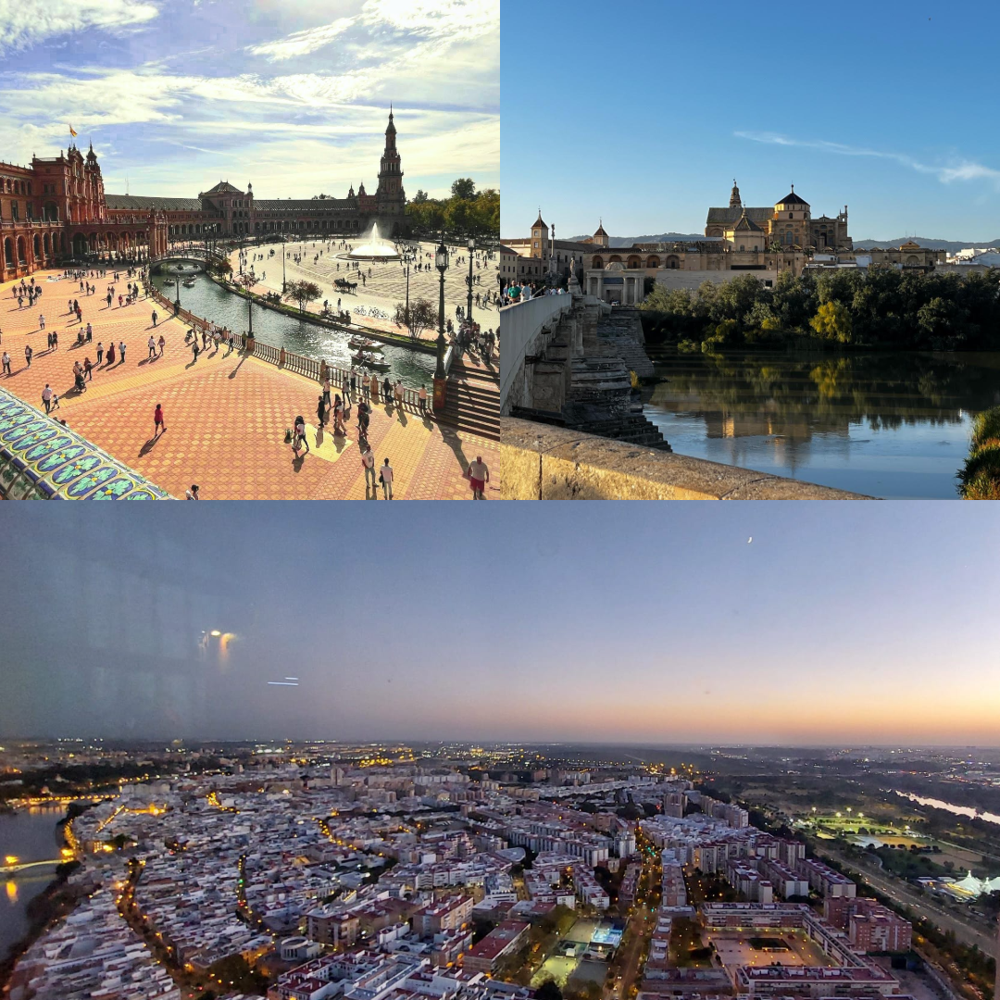
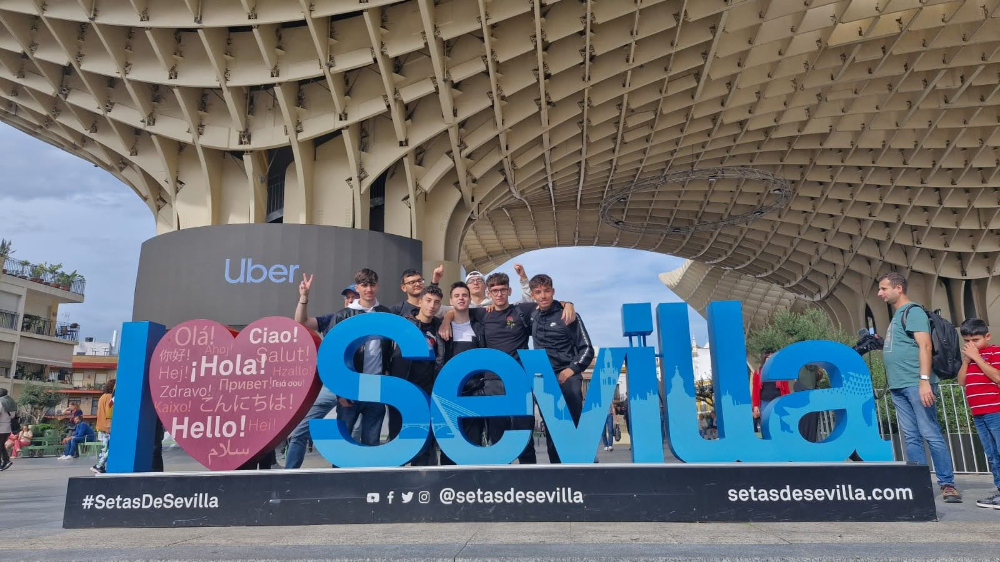

## Panoramica
Durante un piccolo Erasmus di 14 giorni a Siviglia, io e altri 14 studenti della scuola abbiamo avuto l’opportunità di vivere un’esperienza formativa intensa e varia. Il progetto prevedeva innanzitutto un breve corso di spagnolo, che ci ha permesso di migliorare rapidamente le competenze linguistiche e di immergerci nella cultura locale. Parallelamente abbiamo conosciuto da vicino alcune attività informatiche della città, entrando in contatto con realtà professionali e metodologie di lavoro diverse da quelle a cui eravamo abituati.

Non sono mancate le occasioni per esplorare il territorio: abbiamo partecipato a visite guidate ai monumenti più importanti di Siviglia, scoprendo la sua storia e la sua architettura unica. L’esperienza si è arricchita ulteriormente con due escursioni fuori città, che ci hanno portati a visitare Cadice e Cordova, entrambe ricche di patrimonio culturale e fascino storico.

## La mia esperienza personale
Vivere il PCTO a Siviglia è stato per me molto più di una semplice esperienza scolastica. In quei 14 giorni ho avuto l’occasione di crescere davvero: usare l’inglese ogni giorno mi ha aiutato a migliorarlo in modo naturale, senza nemmeno accorgermene, mentre il contatto con una realtà diversa mi ha permesso di avvicinarmi a un’altra cultura e di comprenderla dall’interno. Allo stesso tempo, questo percorso mi ha dato la possibilità di stringere nuove relazioni interpersonali e, soprattutto, di rafforzare l’amicizia con i compagni di scuola che hanno condiviso con me ogni momento. È stata un’esperienza che mi ha lasciato qualcosa di profondo e che porterò con me anche in futuro.

